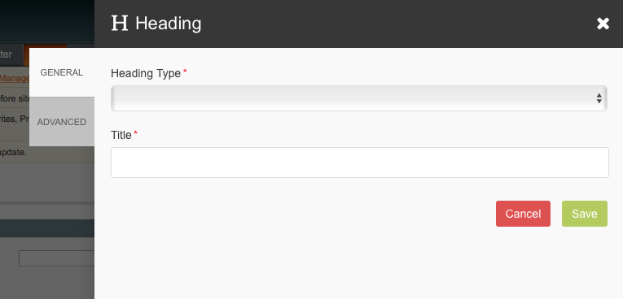

# Blue Foot: Page Builder
## Edit
The edit panel is the sidebar that scrolls into the right whenever a user is editing content.

The panel is built up of multiple fields, or widgets. Each field or widget is responsible for the mark up and functionality of that particular field. The core system ships with all core Magento input types support, along with a number of extra widgets which can be assigned to [content attributes](/PageBuilderBlocks/ContentAttributes.md).

[Input Types](/PageBuilder/Edit/InputTypes.md)

[Widgets](/PageBuilder/Edit/Widgets.md)
