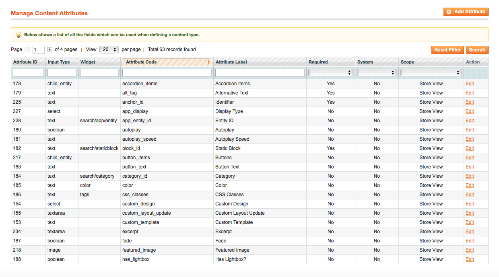
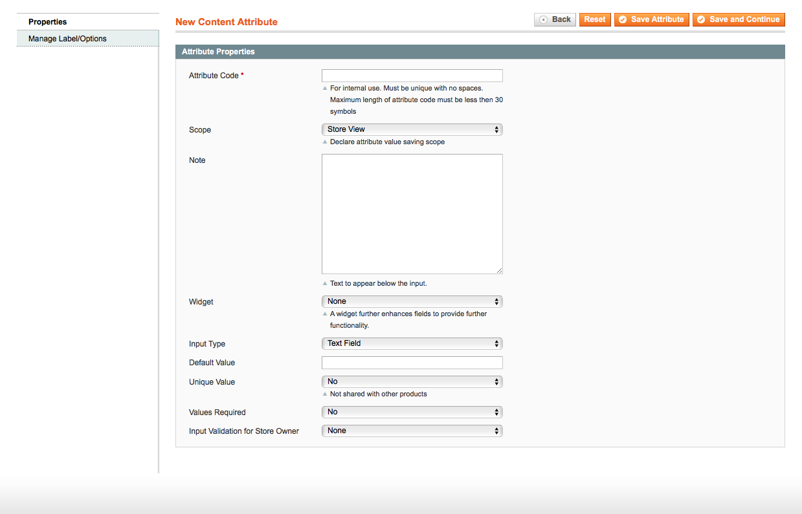
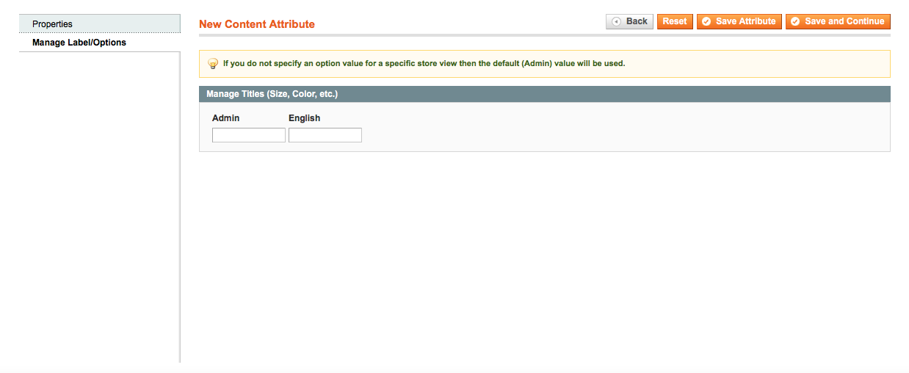

# Blue Foot: Page Builder Blocks
## Content Attributes
Each block within the page builder is built up of content attributes. These follow the core Magento EAV structure. An attribute can be assigned to multiple page builder blocks. 

### Admin Interface
You can manage and create these via `System > BlueFoot > Content Attributes`

##### Manage Content Attributes

##### Add Attribute

