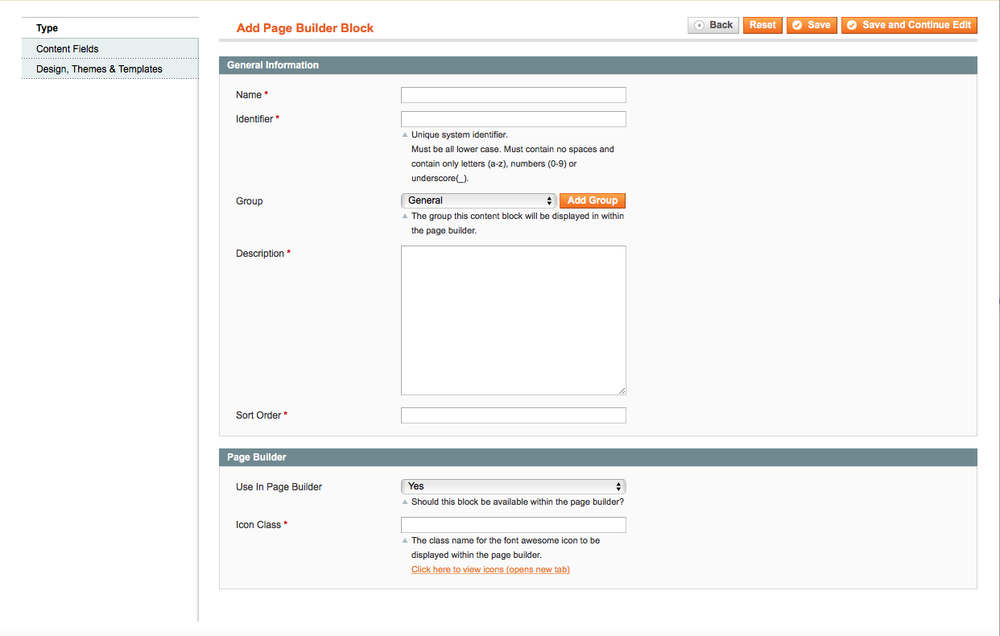
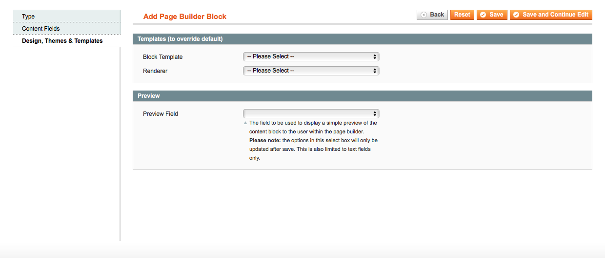

# Blue Foot: Page Builder Blocks
## Overview
The page builder is built up of a number of different page builder blocks. Each of these blocks represents a different bit of content. This could be a heading, textarea or even a slider. Each of these blocks are built up using Magento's built in EAV structure. A page builder block can have any number of fields and groups assigned to it. Allowing anyone to utilise BlueFoot to create reusable and beautiful blocks.

### Admin Interface
To start you'll need to build up your blocks fields and structure. This can be done directly in the admin under `System > BlueFoot > Page Builder Blocks > Add Page Builder Block`. You'll be presented with the following 3 tabs.

##### Type
The type tab allows you to configure the basic details around the page builder block. This includes whether or not this block can be used directly in the page builder. If a block is going to be a child block of another block then you may want it to be hidden from the left hand panel in the page builder.

##### Content Fields
These are the attributes that are assigned into your block, you're able to add new fields via the `System > BlueFoot > Content Attributes`. These follow the same structure as product and category attributes in Magento.

##### Design
The design tab allows you to configure the front-end block template and renderer. These dictate how the block should be rendered to your end users on the front-end of your store. The preview field is used within the page builder view when an admin preview template isn't configured.

